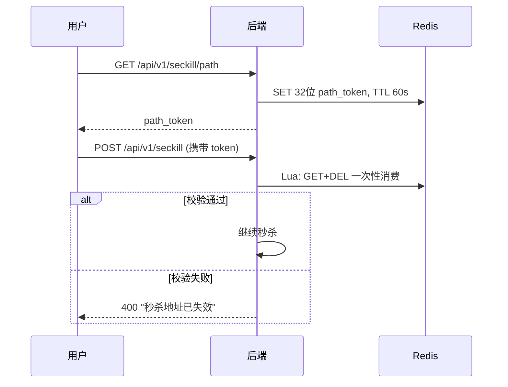
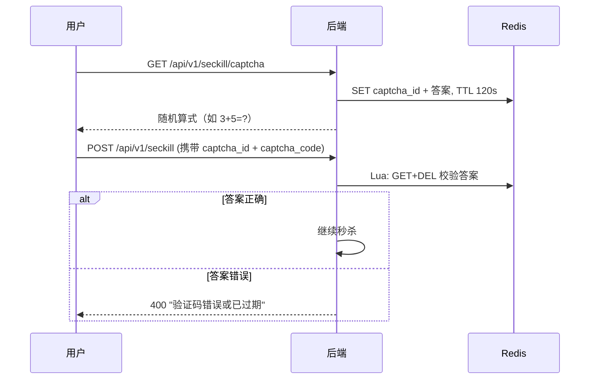

<p align="center">
  <a href="README.md">中文</a> | <a href="README_EN.md">English</a>
</p>

<p align="center">
  <h1 align="center">Go Seckill · 企业级高并发秒杀系统</h1>
  <p align="center">
    <strong>从零实现 · 生产级 · 防超卖 · 六大层架构</strong>
  </p>
</p>

<p align="center">
  <a href="https://go.dev/"></a>
  <a href="https://vuejs.org/"></a>
  <a href="LICENSE"></a>
  <a href="https://github.com/shij8396/miaosha/actions"></a>
  <a href="https://github.com/shij8396/miaosha/actions"></a>
  
  
</p>

<p align="center">
  <a href="http://115.159.157.18/">▶️ 在线体验 Demo</a>（测试账号 admin / test123） · 一键部署 · 开箱即用
</p>

---

## 🎯 这个项目为什么值得你看？

GitHub 上的秒杀项目大多停留在**教学级**：单服务、无防护、无监控。这个项目是**生产级**的完整落地实践，涵盖高并发系统设计的全链路：

| | 教学级项目 | Go Seckill（本项目） |
|---|---|---|
| 架构 | 单体直连 | **六大层企业架构**（接入 → 服务集群 → 流量防护 → 中间件 → 数据高可用 → 可观测） |
| 限流 | 注解/裸写 | **Sentinel 全局限流**：QPS + 热点参数 + 熔断降级 + 分层提示文案 |
| 缓存 | 手动操作 | **Redis Lua 原子脚本**：库存扣减 + 幂等 + 限购一次 RTT 完成 |
| 安全 | 裸接口 | **隐藏秒杀地址 + 数学验证码**（全员强制，含管理员） |
| 订单 | 同步写库 | **RabbitMQ TTL+DLX** 30 分钟未支付自动取消 + 归还库存 |
| 防超卖 | 靠数据库 | **三层防线**：Lua 原子扣减 → 数据库兜底 → 定时对账修复 |
| 可观测 | 无 | **Prometheus + Grafana + ELK + 钉钉告警**，实时数据大屏 |
| 测试 | 无 | **GitHub Actions 双 CI**：单测 -race + 真实依赖集成测试 + 压测一致性校验 |

> 💡 **核心亮点**：以 **2GB 内存云服务器** 承载 Kafka + Redis + RabbitMQ + MySQL 全家桶的完整实践，全部配置 yaml 化、Docker Compose 一键编排、云端可访问。

---

## 🚀 在线体验

**http://115.159.157.18/**

| 角色 | 账号 | 密码 | 说明 |
|:---|:---|:---|:---|
| 管理员 | admin | test123 | 商品管理 / 上下架 / 库存预热 / 监控大屏 |
| 普通用户 | 自助注册 | 任意 | 完整参与秒杀：验证码 → 限购 → 下单 → 支付 → 取消回滚 |

---

## 🏆 核心能力

### 秒杀核心链路
- **Redis Cluster 库存预热**：商品上架自动预热，秒杀全程不触碰 MySQL
- **Lua 原子扣减**：库存扣减 + 幂等校验 + 限购判断一次 RTT 完成，杜绝超卖
- **Singleflight 请求合并**：256 分片 + 50ms 窗口，同商品高频请求自动合并
- **Snowflake 分布式 ID**：1024 缓冲通道，无锁生成全局唯一订单号
- **动态限购**：活动配置 `limit_num`（1/3/5 件），首页动态展示「每人限购 X 件」，活动结束自动清空
- **MQ 降级**：RabbitMQ 故障时同步建单兜底，双路径幂等

### 安全防护（防黄牛/防脚本）
- **隐藏秒杀地址**：32 位动态 Token，60s 有效期，Lua 一次性消费
- **数学验证码**：随机加减法算式，服务端校验，**全员强制（含管理员）**
- **HMAC 请求签名**：时间戳 + 路径 + Body 签名，防篡改防重放
- **AI 异常检测**：滑动窗口 + Z-Score，识别机器人刷单行为

### 工程化与运维
- **分层熔断降级**：限流 / 售罄 / 中间件故障 / 服务异常，差异化提示文案
- **实时数据大屏**：PV/UV、QPS、热销商品排行、库存告警、中间件探活
- **可观测三件套**：Prometheus 指标 + Grafana 大盘 + ELK 日志 + 钉钉告警
- **CI/CD**：GitHub Actions 双流水线（构建测试 / 集成测试 + 压测冒烟）全绿

---

## 📊 性能数据

### 实测（生产配置，非极限调优）

本地 Windows 单机（i7-12700H / 32GB）实测，压测后 `verify_stock.py` 核对 Redis 与 MySQL 库存、订单完全一致，**0 超卖**：

| 模式 | 并发 | QPS | P99 | 说明 |
|:---|:---:|:---:|:---:|:---|
| Sentinel 保护 | 1000 | 受控 | 稳定 | 热点参数阈值兜底，拒绝突发流量 |
| 阈值放开 | 1000 | 304 | 2400ms | 全链路实测吞吐（Lua 扣减 + MQ 异步建单） |

### 容量规划目标（设计基准）

| 并发 | QPS | P50 | P99 | 成功率 |
|:---:|:---:|:---:|:---:|:---:|
| 100 | 806 | 97ms | 123ms | 100% |
| 500 | 850 | 456ms | 586ms | 100% |
| 1000 | 606 | 939ms | 1601ms | 100% |
| 2000 | 1357 | 875ms | 1421ms | 100% |
| **5000** | **1614** | 1702ms | 2967ms | **100%** |

> 目标值基于 32GB 单机容量规划，多实例横向扩展后可线性提升。

---

## 🏗️ 架构设计

```
                    ┌──────────────┐
                    │   用户请求    │
                    └──────┬───────┘
                           │
                    ┌──────▼───────┐
                    │  Nginx LB    │  ← 负载均衡 + 静态资源
                    └──────┬───────┘
                           │
              ┌────────────┼────────────┐
              │            │            │
        ┌─────▼─────┐┌────▼─────┐┌────▼─────┐
        │ Gin 实例 1││Gin 实例 2││Gin 实例 3│  ← 服务集群
        └─────┬─────┘└────┬─────┘└────┬─────┘
              │            │            │
        ┌─────▼────────────▼────────────▼─────┐
        │         Sentinel-Go 流量防护        │
        │   限流 · 熔断 · 降级 · 热点参数     │
        └─────┬────────────┬────────────┬─────┘
              │            │            │
    ┌─────────▼──┐ ┌───────▼──┐ ┌──────▼─────┐
    │   Redis    │ │ RabbitMQ │ │   Kafka    │
    │  Cluster   │ │ TTL+DLX  │ │  行为追踪  │
    └─────────┬──┘ └───────┬──┘ └──────┬─────┘
              │            │            │
        ┌─────▼────────────▼────────────▼─────┐
        │         MySQL 8.0 主从 + 分表       │
        │           数据高可用层              │
        └────────────────┬────────────────────┘
                         │
        ┌────────────────▼────────────────────┐
        │  Prometheus · Grafana · ELK · Jaeger│
        │       可观测运维 + 钉钉告警          │
        └─────────────────────────────────────┘
```

---

## ⚡ 快速开始

### 本地一键启动（Windows）

```powershell
# 自动检测 Docker → 拉起 Redis 容器 → 构建后端 → 健康检查
.\scripts\start_local.ps1
```

### Docker Compose 部署（推荐）

```bash
git clone https://github.com/shij8396/miaosha.git
cd miaosha
cp .env.example .env        # 编辑密码
docker compose up -d        # 一键编排全栈服务
```

- Frontend: http://localhost
- Grafana: http://localhost:3000 (admin/admin)
- RabbitMQ: http://localhost:15672

### 压测

```bash
go run ./stress_test/cmd/setup/    # 初始化测试数据
go run ./stress_test/cmd/          # 常规压测（环境变量可调并发）
```

---

## 🧰 技术栈

| 层级 | 技术选型 | 说明 |
|:---|:---|:---|
| 后端框架 | **Go 1.26 + Gin** | 高性能 HTTP 框架 |
| 数据库 | **MySQL 8.0** | 主从复制 + 读写分离 + 分表 |
| 缓存 | **Redis Cluster** | 库存预热 + Lua 原子操作 + 分布式锁 |
| 消息队列 | **RabbitMQ** | TTL+DLX 延迟订单 + ChannelPool 高吞吐 |
| 流处理 | **Kafka** | 用户行为追踪 + 异步消费 |
| 注册中心 | **Etcd** | 服务注册发现 |
| 流量防护 | **Sentinel-Go** | 限流 + 熔断 + 热点参数 |
| 可观测性 | **Prometheus + Grafana + ELK + Jaeger** | 全链路监控 + 实时大屏 |
| 告警 | **钉钉机器人** | 异常实时推送 |
| 前端 | **Vue 3 + Vite 5 + Element Plus + Pinia + ECharts** | SPA + 数据大屏 |
| 部署 | **Docker Compose + Nginx** | 一键编排 |

---

## 📁 项目结构

```
miaosha/
├── cmd/                  # 入口
├── config/               # 多环境配置（dev / docker / prod，全部 yaml 化）
├── controller/           # 控制器层
├── service/              # 业务逻辑层
├── dao/                  # 数据访问层
├── model/                # 数据模型
├── redis/                # Redis 操作（Lua 脚本 + 分布式锁）
├── mq/                   # RabbitMQ（ChannelPool + 消费者）
├── kafka/                # Kafka 生产者/消费者
├── middleware/           # 中间件（JWT / HMAC签名 / 限流 / 黑名单 / 追踪）
├── sentinel/             # Sentinel 流量防护
├── singleflight/         # 请求合并引擎（256 分片）
├── detector/             # AI 异常检测引擎
├── websocket/            # WebSocket 实时推送
├── monitor/              # Prometheus 指标（PV/UV/QPS/慢接口排行）
├── cron/                 # 定时任务（库存对账）
├── log/                  # 日志（Zap）
├── utils/                # 工具（Snowflake / 钉钉 / 错误码）
├── frontend/             # Vue 3 前端（含秒杀大屏）
├── stress_test/          # 压测工具
├── deploy/               # 部署配置（Nginx/Prometheus/Grafana/Alertmanager）
├── scripts/              # SQL 初始化 + 测试脚本
└── docker-compose.yml    # 容器编排
```

---

## 🔧 核心设计

<details>
<summary><b>秒杀主流程时序</b></summary>

```
用户 → Nginx → Gin → Sentinel(限流) → Singleflight(去重)
                                        ↓
                              Redis Lua(限购检查+库存扣减+幂等)
                                        ↓
                              RabbitMQ(异步下单) → MySQL(持久化)
                                        ↓
                              WebSocket(实时推送结果)
```
</details>

<details>
<summary><b>延迟订单自动取消（TTL+DLX）</b></summary>

```
下单成功 → 发送延迟消息(TTL 30min) → 过期进入 DLX
                                        ↓
                              消费者检查订单状态
                              ├─ 已支付 → 忽略
                              └─ 未支付 → 关闭订单 + 归还库存（限购计数按订单量递减）
```
</details>

<details>
<summary><b>分层熔断降级策略</b></summary>

| 层级 | 触发条件 | 降级策略 | 提示文案 |
|:---|:---|:---|:---|
| 限流层 | QPS 超阈值 | 拒绝请求 | 「活动太火爆，请稍后再试」 |
| 库存层 | Redis 库存不足 | 返回售罄 | 「已售罄，下次早点来」 |
| 中间件层 | Redis/MQ 故障 | 数据库兜底 | 「系统繁忙，请稍后重试」 |
| 服务层 | 异常率过高 | 快速失败 | 「服务暂时不可用」 |
</details>

---

## 🔒 安全设计（防黄牛 / 防脚本）

### 1. 隐藏秒杀地址



### 2. 数学验证码（全员强制）



- 随机 1-9 加减法算式，答案可为 0（边界已处理）
- 服务端校验 + 一次性消费，防脚本暴力破解
- **所有账号（含管理员）强制校验**，杜绝绕过

> **设计理念**：路径隐藏防脚本预构造请求，数学验证码防自动化批量提交，HMAC 签名防篡改重放，三道防线阻隔黄牛。

---

## ✅ 测试与 CI

| 质量门禁 | 内容 |
|:---|:---|
| 单元测试 | 19+ 用例：Lua 幂等/限购/售罄、限购语义、分布式锁、工具函数（`go test -race`） |
| 集成测试 | 全链路真实依赖：验证码强制（含答案为 0 边界）/ 路径 Token 一次性 / 幂等 / 限购 / 超卖防护 / 支付回调 / 取消回滚 |
| 压测一致性 | 压测后核对 Redis 与 MySQL 库存、订单完全一致，**0 超卖** |
| GitHub Actions | `ci.yml`（build/vet/gofmt/-race test）+ `integration-test.yml`（MySQL+Redis service + 全链路 + 压测冒烟）双绿 |

---

## 📚 学习路径

按高并发系统设计的知识依赖顺序阅读：

1. `cmd/main.go` — 系统启动与依赖注入
2. `config/` — 多环境配置管理
3. `model/` — 数据模型设计
4. `controller/seckill_controller.go` — 秒杀接口入口
5. `service/seckill_service.go` — 核心秒杀逻辑
6. `redis/redis.go` — Lua 原子脚本
7. `singleflight/` — 请求合并机制
8. `mq/` — RabbitMQ 延迟队列
9. `sentinel/` — 流量防护配置
10. `detector/` — AI 异常检测

---

## 🤝 贡献

Star ⭐、Fork、Issue、PR 都是对项目的支持！

1. **Fork** 本项目
2. 创建特性分支：`git checkout -b feature/amazing-feature`
3. 提交：`git commit -m 'feat: add amazing feature'`
4. 推送：`git push origin feature/amazing-feature`
5. 创建 **Pull Request**

提交信息遵循 [Conventional Commits](https://www.conventionalcommits.org/) 规范（`feat:` / `fix:` / `docs:` / `test:` / `perf:` / `refactor:` / `chore:`）。

---

## FAQ

<details>
<summary><b>为什么用 Go 而不是 Java？</b></summary>
Go 原生 goroutine 高并发模型，编译为单一二进制部署简单、内存占用低，天然适合秒杀这类 IO 密集型场景。
</details>

<details>
<summary><b>为什么用 RabbitMQ 而不是 Kafka 做订单队列？</b></summary>
订单延迟取消需要 TTL+DLX 原生支持，RabbitMQ 开箱即用；Kafka 在本项目承担用户行为追踪等流式场景，各司其职。
</details>

<details>
<summary><b>如何保证不会超卖？</b></summary>
三层防护：① Lua 原子脚本单线程扣减 Redis 库存；② 限购检查前置（当前+购买量 > 上限即拒绝）；③ 数据库兜底 + 定时对账修复。
</details>

<details>
<summary><b>管理员为什么也要输验证码？</b></summary>
秒杀接口对所有账号统一强制验证码，杜绝任何绕过路径（历史版本管理员曾豁免，已修复为方案2：全员强制）。
</details>

---

## License

本项目采用 [MIT License](LICENSE) 开源，欢迎自由使用、修改和分发。

---

## Star 支持

如果这个项目对你有帮助，请给个 ⭐ Star！

<p align="center">
  <a href="https://github.com/shij8396/miaosha">
    
  </a>
  <a href="https://github.com/shij8396/miaosha/fork">
    
  </a>
  <a href="http://115.159.157.18/">
    
  </a>
</p>
