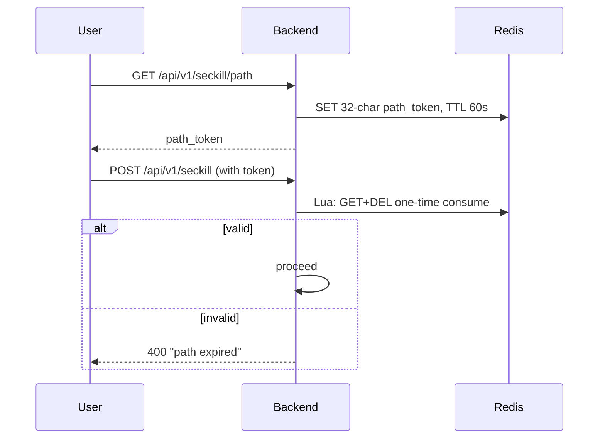
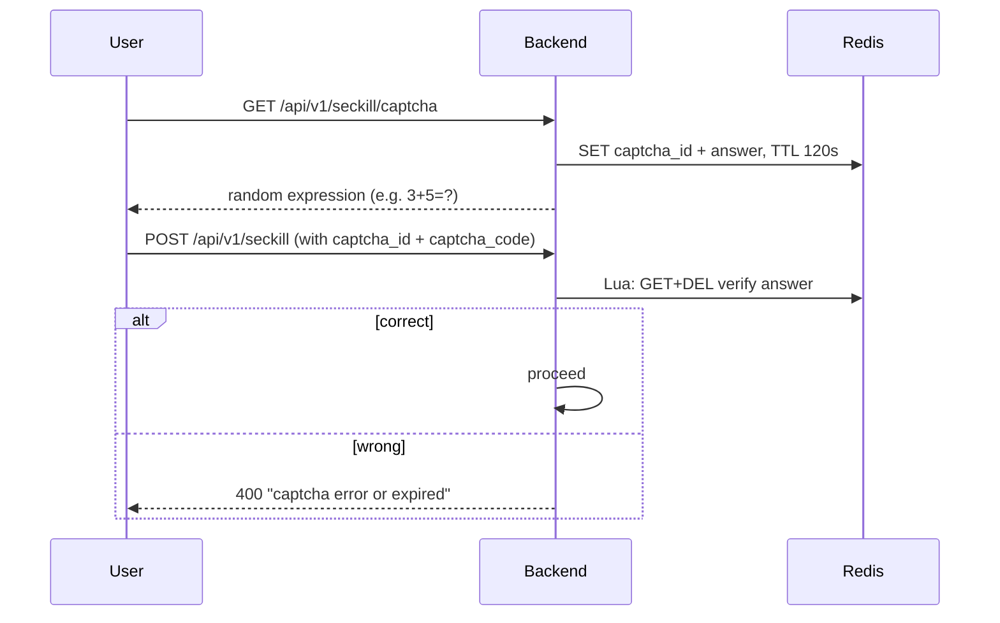

<p align="center">
  <a href="README.md">中文</a> | <a href="README_EN.md">English</a>
</p>

<p align="center">
  <h1 align="center">Go Seckill · Enterprise High-Concurrency Flash Sale System</h1>
  <p align="center">
    <strong>Built from scratch · Production-grade · Zero oversell · Six-layer architecture</strong>
  </p>
</p>

<p align="center">
  <a href="https://go.dev/"></a>
  <a href="https://vuejs.org/"></a>
  <a href="LICENSE"></a>
  <a href="https://github.com/shij8396/miaosha/actions"></a>
  <a href="https://github.com/shij8396/miaosha/actions"></a>
  
  
</p>

<p align="center">
  <a href="http://115.159.157.18/">▶️ Live Demo</a>（test account: admin / test123） · One-click deploy
</p>

---

## 🎯 Why This Project?

Most seckill projects on GitHub are **teaching-level**: single service, no traffic protection, no observability. This project is a **production-grade** full-stack practice covering the entire high-concurrency design chain:

| | Teaching-Level | Go Seckill (this repo) |
|---|---|---|
| Architecture | Monolithic | **Six-Layer Enterprise** (Access → Service Cluster → Traffic Control → Middleware → Data HA → Observability) |
| Rate Limiting | Annotations / raw code | **Sentinel global control**: QPS + hot-param + circuit breaking + differentiated messages |
| Cache | Manual Redis ops | **Redis Lua atomic script**: stock deduction + idempotency + purchase limit in one RTT |
| Security | Exposed endpoints | **Hidden seckill path + math captcha** (enforced for ALL users, including admin) |
| Orders | Sync DB write | **RabbitMQ TTL+DLX**: auto-cancel unpaid orders in 30 min + restock |
| Oversell | Rely on DB | **Three defense layers**: Lua atomic deduction → DB fallback → scheduled reconciliation |
| Observability | None | **Prometheus + Grafana + ELK + DingTalk alerts**, real-time dashboard |
| Testing | None | **GitHub Actions dual CI**: unit tests -race + integration tests + stress-test consistency check |

> 💡 **Highlight**: A complete practice running the full stack (Kafka + Redis + RabbitMQ + MySQL) on a **2GB RAM cloud server**, with all configs in YAML, Docker Compose orchestration, and a live cloud demo.

---

## 🚀 Live Demo

**http://115.159.157.18/**

| Role | Account | Password | Notes |
|:---|:---|:---|:---|
| Admin | admin | test123 | Product management / on-off shelf / stock pre-warm / monitoring dashboard |
| User | self-register | any | Full seckill flow: captcha → purchase limit → order → pay → cancel rollback |

---

## 🏆 Core Features

### Seckill Core Path
- **Redis Cluster pre-warming**: stock pre-loaded on product launch; MySQL untouched during seckill
- **Lua atomic deduction**: stock deduction + idempotency + purchase limit in one RTT, zero oversell
- **Singleflight request coalescing**: 256 shards + 50ms window, high-frequency requests auto-merged
- **Snowflake distributed ID**: 1024-buffer lock-free channel for global unique order IDs
- **Dynamic purchase limit**: per-activity `limit_num` (1/3/5 items), shown on home page, auto-cleared after activity
- **MQ fallback**: synchronous order creation when RabbitMQ is down, dual-path idempotency

### Security (anti-bot / anti-scalper)
- **Hidden seckill path**: 32-char dynamic token, 60s TTL, one-time Lua consumption
- **Math captcha**: random addition/subtraction, server-side validation, **enforced for all users (incl. admin)**
- **HMAC request signing**: timestamp + path + body signing, anti-tamper / anti-replay
- **AI anomaly detection**: sliding window + Z-Score to detect bot behavior

### Engineering & Ops
- **Layered circuit breaking**: differentiated messages for limit / sold-out / middleware failure / service anomaly
- **Real-time dashboard**: PV/UV, QPS, hot-product ranking, inventory alerts, middleware health
- **Observability stack**: Prometheus metrics + Grafana dashboards + ELK logs + DingTalk alerts
- **CI/CD**: GitHub Actions dual pipelines (build & test / integration + stress smoke) all green

---

## 📊 Performance

### Measured (production config, not max-tuned)

Measured on a local Windows machine (i7-12700H / 32GB). After stress testing, `verify_stock.py` confirmed Redis and MySQL stock/orders are fully consistent — **0 oversell**:

| Mode | Concurrency | QPS | P99 | Notes |
|:---|:---:|:---:|:---:|:---|
| Sentinel protection | 1000 | throttled | stable | Hot-param threshold rejects bursts |
| Threshold released | 1000 | 304 | 2400ms | Full-path throughput (Lua + async MQ order) |

### Capacity Planning Targets (design baseline)

| Concurrency | QPS | P50 | P99 | Success |
|:---:|:---:|:---:|:---:|:---:|
| 100 | 806 | 97ms | 123ms | 100% |
| 500 | 850 | 456ms | 586ms | 100% |
| 1000 | 606 | 939ms | 1601ms | 100% |
| 2000 | 1357 | 875ms | 1421ms | 100% |
| **5000** | **1614** | 1702ms | 2967ms | **100%** |

> Targets are capacity plans for a 32GB single machine; horizontal scaling scales throughput linearly.

---

## 🏗️ Architecture

```
                    ┌──────────────┐
                    │ User Request │
                    └──────┬───────┘
                           │
                    ┌──────▼───────┐
                    │  Nginx LB    │  ← Load balance + static assets
                    └──────┬───────┘
                           │
              ┌────────────┼────────────┐
              │            │            │
        ┌─────▼─────┐┌────▼─────┐┌────▼─────┐
        │ Gin node 1││Gin node 2││Gin node 3│  ← Service cluster
        └─────┬─────┘└────┬─────┘└────┬─────┘
              │            │            │
        ┌─────▼────────────▼────────────▼─────┐
        │         Sentinel-Go Traffic        │
        │   Rate limit · Fuse · Degrade · Hot│
        └─────┬────────────┬────────────┬─────┘
              │            │            │
    ┌─────────▼──┐ ┌───────▼──┐ ┌──────▼─────┐
    │   Redis    │ │ RabbitMQ │ │   Kafka    │
    │  Cluster   │ │ TTL+DLX  │ │ Behavior   │
    └─────────┬──┘ └───────┬──┘ └──────┬─────┘
              │            │            │
        ┌─────▼────────────▼────────────▼─────┐
        │        MySQL 8.0 master-slave      │
        │          Data HA layer             │
        └────────────────┬────────────────────┘
                         │
        ┌────────────────▼────────────────────┐
        │  Prometheus · Grafana · ELK · Jaeger│
        │      Observability + DingTalk      │
        └─────────────────────────────────────┘
```

---

## ⚡ Quick Start

### One-Click Local Start (Windows)

```powershell
# Auto-detects Docker → starts Redis container → builds backend → health check
.\scripts\start_local.ps1
```

### Docker Compose Deploy (recommended)

```bash
git clone https://github.com/shij8396/miaosha.git
cd miaosha
cp .env.example .env        # edit passwords
docker compose up -d        # orchestrate full stack
```

- Frontend: http://localhost
- Grafana: http://localhost:3000 (admin/admin)
- RabbitMQ: http://localhost:15672

### Stress Test

```bash
go run ./stress_test/cmd/setup/    # init test data
go run ./stress_test/cmd/          # run stress test (concurrency via env vars)
```

---

## 🧰 Tech Stack

| Layer | Technology | Notes |
|:---|:---|:---|
| Framework | **Go 1.26 + Gin** | High-performance HTTP |
| Database | **MySQL 8.0** | Master-slave + read/write split + sharding |
| Cache | **Redis Cluster** | Stock pre-warm + Lua atomic ops + distributed lock |
| MQ | **RabbitMQ** | TTL+DLX delayed orders + ChannelPool high throughput |
| Streaming | **Kafka** | User behavior tracking + async consumption |
| Registry | **Etcd** | Service discovery |
| Traffic | **Sentinel-Go** | Rate limit + fuse + hot params |
| Observability | **Prometheus + Grafana + ELK + Jaeger** | Full-chain monitoring + live dashboard |
| Alerts | **DingTalk bot** | Real-time push |
| Frontend | **Vue 3 + Vite 5 + Element Plus + Pinia + ECharts** | SPA + dashboard |
| Deploy | **Docker Compose + Nginx** | One-click orchestration |

---

## 📁 Project Structure

```
miaosha/
├── cmd/                  # entrypoint
├── config/               # multi-env config (dev / docker / prod, all YAML)
├── controller/           # controllers
├── service/              # business logic
├── dao/                  # data access
├── model/                # data models
├── redis/                # Redis ops (Lua scripts + distributed lock)
├── mq/                   # RabbitMQ (ChannelPool + consumers)
├── kafka/                # Kafka producer/consumer
├── middleware/           # JWT / HMAC signing / rate limit / blacklist / tracing
├── sentinel/             # Sentinel traffic protection
├── singleflight/         # request coalescing engine (256 shards)
├── detector/             # AI anomaly detection engine
├── websocket/            # real-time push
├── monitor/              # Prometheus metrics (PV/UV/QPS/slow APIs)
├── cron/                 # scheduled jobs (stock reconciliation)
├── log/                  # logging (Zap)
├── utils/                # utils (Snowflake / DingTalk / error codes)
├── frontend/             # Vue 3 frontend (incl. dashboard)
├── stress_test/          # stress test tool
├── deploy/               # Nginx/Prometheus/Grafana/Alertmanager configs
├── scripts/              # SQL init + test scripts
└── docker-compose.yml    # container orchestration
```

---

## 🔧 Core Design

<details>
<summary><b>Seckill main flow</b></summary>

```
User → Nginx → Gin → Sentinel(limit) → Singleflight(dedup)
                                        ↓
                      Redis Lua(purchase-limit check + stock deduct + idempotency)
                                        ↓
                      RabbitMQ(async order) → MySQL(persist)
                                        ↓
                      WebSocket(push result in real time)
```
</details>

<details>
<summary><b>Delayed order auto-cancel (TTL+DLX)</b></summary>

```
Order created → send delayed message (TTL 30min) → expire into DLX
                                        ↓
                              consumer checks order status
                              ├─ paid → ignore
                              └─ unpaid → close order + return stock
```
</details>

<details>
<summary><b>Layered circuit breaking / degradation</b></summary>

| Layer | Trigger | Strategy | Message |
|:---|:---|:---|:---|
| Rate limit | QPS exceeds threshold | Reject | "Too hot, please try later" |
| Stock | Redis stock exhausted | Sold out | "Sold out, come back early" |
| Middleware | Redis/MQ down | DB fallback | "System busy, try again later" |
| Service | High error rate | Fail fast | "Service temporarily unavailable" |
</details>

---

## 🔒 Security (anti-bot / anti-scalper)

### 1. Hidden seckill path



### 2. Math captcha (enforced for everyone)



- Random 1-9 addition/subtraction; answer may be 0 (boundary handled)
- Server-side validation + one-time consumption, blocks brute-force
- **Enforced for ALL accounts (incl. admin)** — no bypass paths

> **Design philosophy**: hidden path blocks script pre-construction, math captcha blocks automated batch submissions, HMAC signing blocks tampering/replay — three lines of defense against scalpers.

---

## ✅ Testing & CI

| Gate | Content |
|:---|:---|
| Unit tests | 19+ cases: Lua idempotency/limit/sold-out, purchase-limit semantics, distributed lock, utils (`go test -race`) |
| Integration tests | Full flow on real deps: captcha enforcement (incl. answer=0) / one-time path token / idempotency / purchase limit / oversell protection / pay callback / cancel rollback |
| Stress consistency | Verify Redis vs MySQL stock & orders after stress — **0 oversell** |
| GitHub Actions | `ci.yml` (build/vet/gofmt/-race test) + `integration-test.yml` (MySQL+Redis services + full flow + stress smoke) both green |

---

## 📚 Learning Path

Read in dependency order for high-concurrency design:

1. `cmd/main.go` — startup & dependency injection
2. `config/` — multi-env config
3. `model/` — data models
4. `controller/seckill_controller.go` — seckill entry
5. `service/seckill_service.go` — core seckill logic
6. `redis/redis.go` — Lua atomic scripts
7. `singleflight/` — request coalescing
8. `mq/` — RabbitMQ delayed queue
9. `sentinel/` — traffic protection
10. `detector/` — AI anomaly detection

---

## 🤝 Contributing

Star ⭐, Fork, Issue, and PR are all great support!

1. **Fork** this repo
2. Create a feature branch: `git checkout -b feature/amazing-feature`
3. Commit: `git commit -m 'feat: add amazing feature'`
4. Push: `git push origin feature/amazing-feature`
5. Open a **Pull Request**

Please follow [Conventional Commits](https://www.conventionalcommits.org/) (`feat:` / `fix:` / `docs:` / `test:` / `perf:` / `refactor:` / `chore:`).

---

## FAQ

<details>
<summary><b>Why Go instead of Java?</b></summary>
Go's native goroutine model suits IO-intensive workloads; it compiles to a single binary with low memory footprint — natural fit for seckill.
</details>

<details>
<summary><b>Why RabbitMQ instead of Kafka for order queue?</b></summary>
Delayed order cancellation needs native TTL+DLX support, which RabbitMQ provides out of the box; Kafka handles user-behavior streaming in this project.
</details>

<details>
<summary><b>How do you guarantee no oversell?</b></summary>
Three layers: ① Lua atomic script deducts Redis stock in single-thread; ② purchase-limit check is placed BEFORE deduction (current + quantity > limit → reject); ③ DB fallback + scheduled reconciliation.
</details>

<details>
<summary><b>Why does admin also need a captcha?</b></summary>
The seckill API enforces captcha for ALL accounts to eliminate any bypass path (an older version exempted admins; fixed to enforce for everyone).
</details>

---

## License

[MIT License](LICENSE). Free to use, modify, and distribute.

---

## Star Us

If this project helps you, please give a ⭐ Star!

<p align="center">
  <a href="https://github.com/shij8396/miaosha">
    
  </a>
  <a href="https://github.com/shij8396/miaosha/fork">
    
  </a>
  <a href="http://115.159.157.18/">
    
  </a>
</p>
